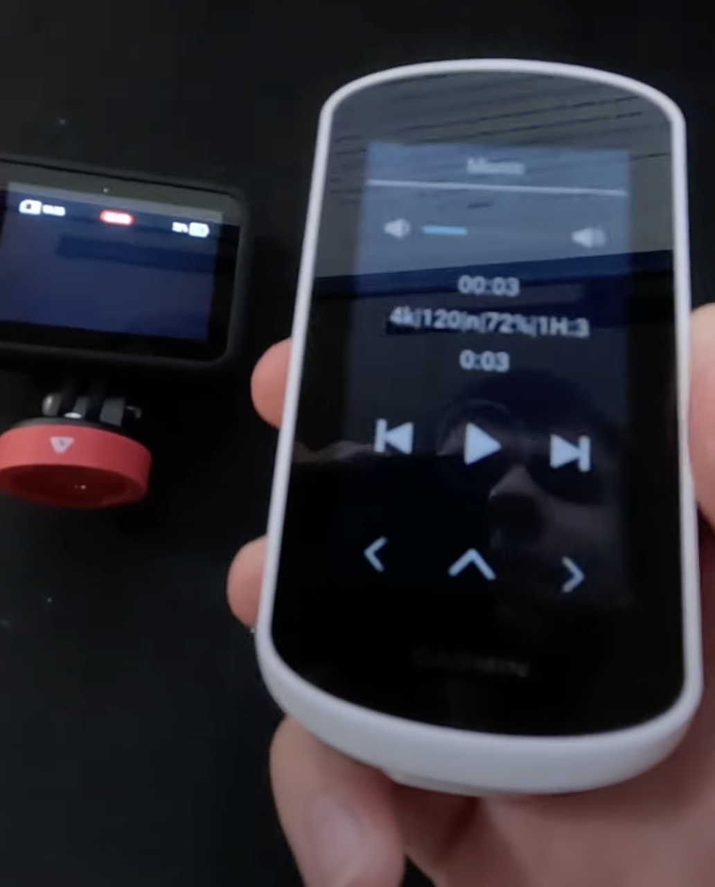
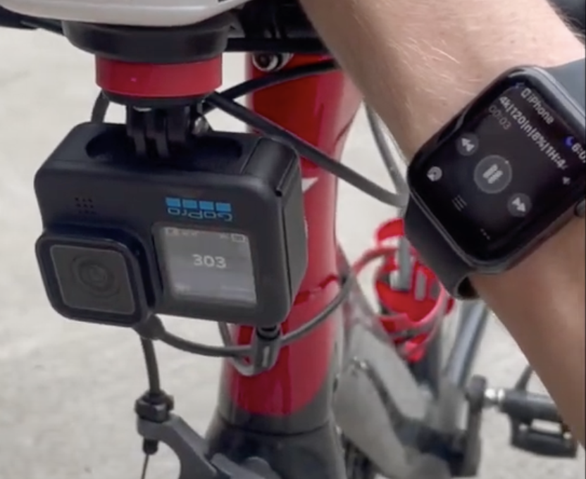

# cliptracer-remote

IOS and Android implementation of GoPo camera control via Media playback interface. Enables camera control using various devices such as smartwatches, cycling computers, headphones etc.
Start/Stop recording, Highlight. Every time the recording starts or stops, the camera goes to sleep to save battery. The app stays awake thankfully to an active media session (10hour audio track). So you just open it once and leave your phone in the pocket.

### Since you simply need a media playback interface to control the camera, it can be anything, for example:

#### Cycling computer

#### Smartwatch

### Video

